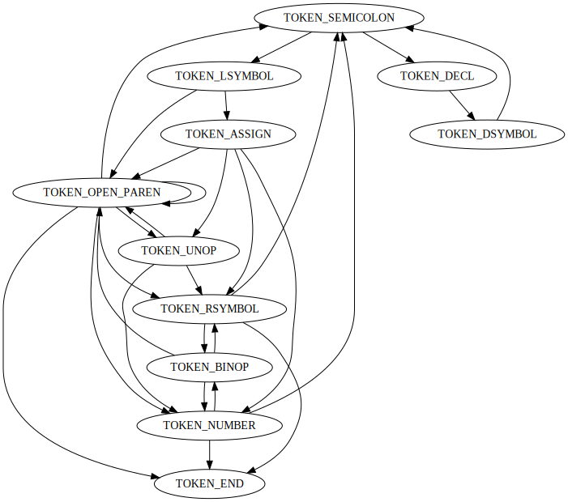

# 编译原理作业

## 计算器描述

计算器接受四则运算表达式为输入（如下图所示）。如果表达式语法正确，则输出计算结果，否则报错，指出错误位置及原因。

```
Input 1:
float a; int b;
a = (10.44*356+1.28) / 2 + 1024 * 1.6;
b = a * 2 – a/2;
write(b);
write(a).
Output 1:
  8743.4
  3497

Input 2:
float a;
int b;
a = (10.44*356+1.28) / 2 + 1024 * 1.6;
b = a * 2 – c/2;
write(b).
Output 2:
  Error(line 4): undefined identifier .
```

1. 支持浮点数和整数两种类型，浮点数可以转换成整数；整数不可以转换成浮点数；
2. 每个语句需要以`;`结束，以`.`表示全部输入的结束
3. 变量需要先声明再使用；
4. 变量名可以是由数字和字母组成，但首字符必须是字母
5. 每个表达式中使用的变量需要在之前已经有赋值。
6. 输出语句使用`write(a)`，输出并换行，其中`a`为`int`类型或者`float`类型的变量名。

## 需要提交

- 文档：描述计算表达式的完整文法，以及如何使用该计算表达式，并给出测试用例；
- 可执行程序与源代码（源代码工程）
- 不得使用任何第三方库，所有程序均为控制台程序，运行时指定两个参数，参数一为输入文件，参数二为输出结果所在的文件

## 问题分析

首先给出文法ebnf定义

```ebnf
program           = {statement, ";"}, statement, ".";

statement         = assignment | procedure_call;
assignment        = symbol, "=", expression;
procedure_call    = symbol, arg_list;

arg_list          = ("(", ")") | "(", {expression, ","}, expression, ")"; 

expression        = unary_expr | bin_expr | parentheses_expr | value | symbol;

parentheses_expr  = "(", expression, ")";

unary_op          = "-" | "+";
unary_expr        = unary_op, expression;

bin_op            = "-" | "+" | "*" | "/";
bin_expr          = expression, bin_op, expression;

symbol            = letter, {letter, digit};

digit             = "0" | "1" | "2" | "3" | "4" | "5" | "6"
                  | "7" | "8" | "9";
letter            = "A" | "B" | "C" | "D" | "E" | "F" | "G"
                  | "H" | "I" | "J" | "K" | "L" | "M" | "N"
                  | "O" | "P" | "Q" | "R" | "S" | "T" | "U"
                  | "V" | "W" | "X" | "Y" | "Z" | "a" | "b"
                  | "c" | "d" | "e" | "f" | "g" | "h" | "i"
                  | "j" | "k" | "l" | "m" | "n" | "o" | "p"
                  | "q" | "r" | "s" | "t" | "u" | "v" | "w"
                  | "x" | "y" | "z" ;
  
integer           = digit, {digit};
float             = digit, {digit}, ".", digit, {digit};
```

由EBNF定义得到解析token的自动机构造如下：

