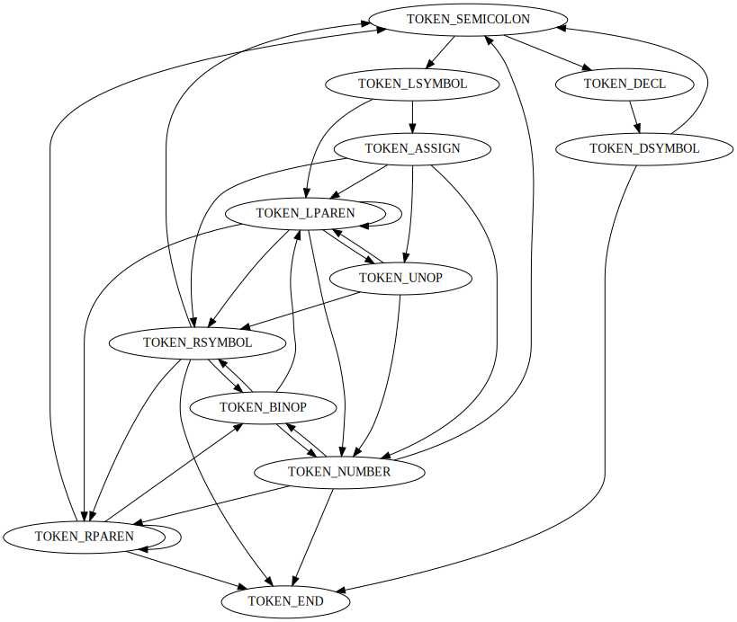

# 编译原理作业

## 问题分析

### 文法定义

首先给出文法ebnf定义

```ebnf
program           = {statement, ";"}, statement, ".";

statement         = assignment | procedure_call | declaration;

declaration       = decl_keyword, symbol;
assignment        = symbol, "=", expression;
procedure_call    = symbol, "(", expression ")";

decl_keyword      = "float" | "int";
expression        = unary_expr | bin_expr | parentheses_expr | value | symbol;

parentheses_expr  = "(", expression, ")";

unary_op          = "-" | "+";
unary_expr        = unary_op, expression;

bin_op            = "-" | "+" | "*" | "/";
bin_expr          = expression, bin_op, expression;

symbol            = letter, {letter, digit};

digit             = "0" | "1" | "2" | "3" | "4" | "5" | "6"
                  | "7" | "8" | "9";
letter            = "A" | "B" | "C" | "D" | "E" | "F" | "G"
                  | "H" | "I" | "J" | "K" | "L" | "M" | "N"
                  | "O" | "P" | "Q" | "R" | "S" | "T" | "U"
                  | "V" | "W" | "X" | "Y" | "Z" | "a" | "b"
                  | "c" | "d" | "e" | "f" | "g" | "h" | "i"
                  | "j" | "k" | "l" | "m" | "n" | "o" | "p"
                  | "q" | "r" | "s" | "t" | "u" | "v" | "w"
                  | "x" | "y" | "z" ;
  
integer           = digit, {digit};
float             = digit, {digit}, ".", digit, {digit};
```

### 源代码转token

由EBNF定义得到解析token的自动机构造如下：



实现自动机引擎，对源代码进行解析即可

### 生成AST

为了生成AST，我们需要`LL(k)`文法，本例中为`LL(2)`，为此需要将原本的文法`expression`的定义进行间接左递归消除，同时将`symbol, integer, float, ops, '(', ')', unary_op, bin_op`当作终结符。消除后的文法如下：

```ebnf
program           = {statement, ";"}, statement, ".";

statement         = assignment | procedure_call | declaration;

declaration       = decl_keyword, symbol;
assignment        = symbol, "=", expression;
procedure_call    = symbol, "(", expression ")";

decl_keyword      = "float" | "int";

expression        = unary_expr | parentheses_expr | value | symbol | bin_expr;

parentheses_expr  = "(", expression, ")";

unary_op          = "-" | "+";
unary_expr        = unary_op, expression;

bin_op            = "-" | "+" | "*" | "/";
bin_expr          = (parenthese_expr | unary_expr | value | symbol) binop expression;
```

根据上述文法即可写出生成每个非终结符对应的的parser，且保证递归过程中每次递归至少消耗一个`Token`（保证算法停机）

### 执行

由于问题较为简单，直接在生成的AST上进行遍历计算即可。


### 测试代码

```
float a; int b;
a = (10.44*356+1.28) / 2 + 1024 * 1.6;
b = a * 2 - a/2;
float c;
c = a + b * 2 - (-(-(2 * (b + 1))));
float d;
d = d + 1;
int e;
e = (c + a) / 0;
write(a);
write(b);
write(c);
write(d);
write(e).
```

输出：

```
3497.359863
5246
3495.359863
undefine<met uninitialized variable>
undefine<met invalid expression>
```

可以看到程序计算正常，对未初始化的变量以及除0错误进行了识别。


